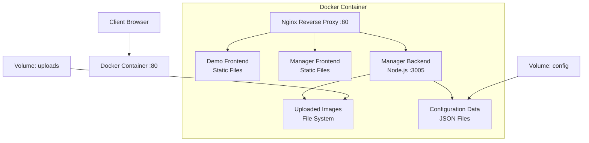
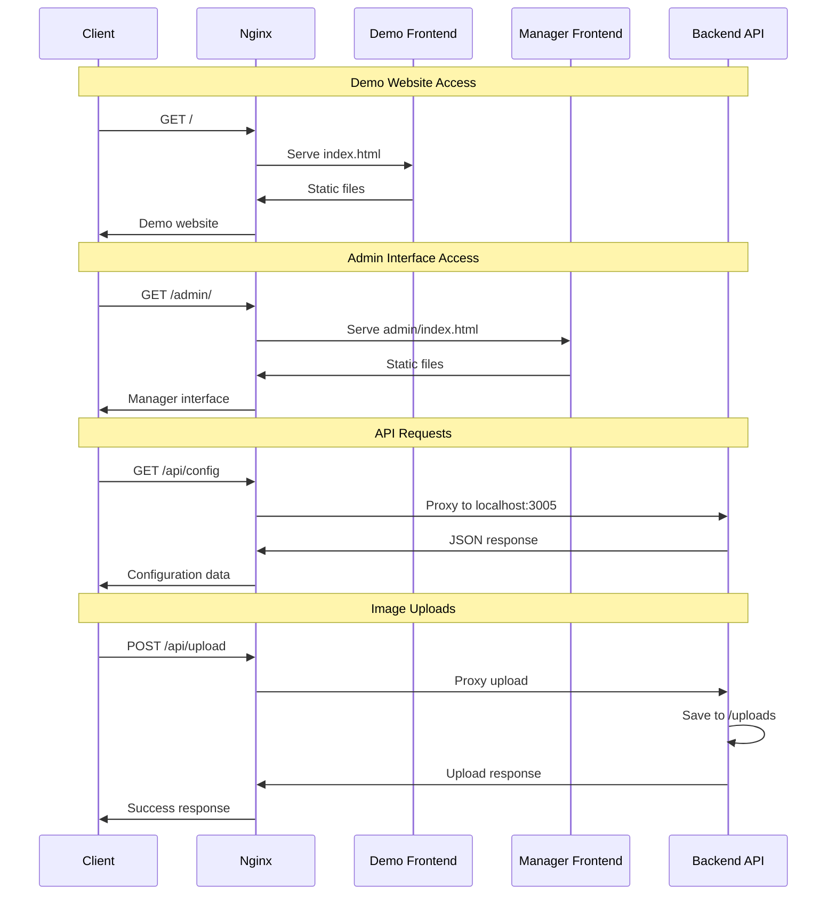

# Design Document: Docker Single Container Deployment

## Overview

This design document outlines the architecture and implementation details for containerizing the B9 Website Recreation system into a single Docker container. The solution uses Nginx as a reverse proxy to route requests to three internal services: Demo Frontend (static files), Manager Frontend (static files), and Manager Backend (Node.js API server).

The containerized architecture eliminates cross-origin issues, simplifies deployment, and maintains all existing functionality while providing a unified deployment unit.

## Architecture

### High-Level Architecture



### Request Routing Flow



## Components and Interfaces

### 1. Nginx Reverse Proxy

**Purpose**: Entry point for all HTTP requests, handles routing and static file serving.

**Configuration Structure**:
```nginx
server {
    listen 80;
    server_name _;
    
    # Demo Frontend - Root path
    location / {
        try_files $uri $uri/ /index.html;
        root /usr/share/nginx/html/demo;
    }
    
    # Manager Frontend - Admin path
    location /admin/ {
        alias /usr/share/nginx/html/manager/;
        try_files $uri $uri/ /admin/index.html;
    }
    
    # API Proxy - Backend services
    location /api/ {
        proxy_pass http://localhost:3005/api/;
        proxy_set_header Host $host;
        proxy_set_header X-Real-IP $remote_addr;
    }
    
    # Static uploads
    location /uploads/ {
        alias /app/uploads/;
        expires 1y;
        add_header Cache-Control "public, immutable";
    }
}
```

**Key Features**:
- Single port exposure (80)
- Path-based routing
- Static file optimization
- Proxy headers for backend communication
- Cache headers for uploaded images

### 2. Demo Frontend (Static Files)

**Build Process**:
```bash
cd demo
npm ci
npm run build
# Output: dist/ directory with optimized static files
```

**Deployment Location**: `/usr/share/nginx/html/demo/`

**Environment Variables**:
- `VITE_API_BASE_URL`: Set to `/api` (relative path)
- `VITE_CDN_BASE_URL`: Set to `/uploads` (relative path)

### 3. Manager Frontend (Static Files)

**Build Process**:
```bash
cd manager/front
npm ci
npm run build
# Output: dist/ directory with optimized static files
```

**Deployment Location**: `/usr/share/nginx/html/manager/`

**Base Path Configuration**: Must be configured for `/admin/` subpath

### 4. Manager Backend (Node.js Service)

**Runtime Configuration**:
- **Port**: 3005 (internal only)
- **Process Manager**: PM2 for production stability
- **File Upload Path**: `/app/uploads/`
- **Configuration Path**: `/app/data/`

**API Endpoints**:
- `GET /api/config` - Retrieve configuration
- `POST /api/config` - Update configuration  
- `POST /api/upload` - Handle file uploads
- `GET /api/health` - Health check endpoint

## Data Models

### Container File System Structure

```
/app/
├── nginx/
│   └── nginx.conf                 # Nginx configuration
├── uploads/                       # Uploaded images (volume mount)
│   ├── banner.jpg
│   ├── background.png
│   └── carousel/
├── data/                         # Configuration data (volume mount)
│   └── config.json
├── backend/                      # Manager Backend source
│   ├── src/
│   ├── package.json
│   └── node_modules/
└── static/                       # Built frontend files
    ├── demo/                     # Demo Frontend build output
    │   ├── index.html
    │   ├── assets/
    │   └── images/
    └── manager/                  # Manager Frontend build output
        ├── index.html
        ├── assets/
        └── admin/
```

### Docker Volume Configuration

```yaml
volumes:
  - ./uploads:/app/uploads          # Persistent image storage
  - ./data:/app/data               # Persistent configuration
```

### Environment Variables Schema

```bash
# API Configuration
API_PORT=3005                     # Backend internal port
API_BASE_URL=/api                 # API base path

# File Upload Configuration  
UPLOAD_PATH=/app/uploads          # Upload directory
MAX_FILE_SIZE=10485760           # 10MB limit

# Frontend Build Configuration
DEMO_BASE_URL=/                   # Demo base path
MANAGER_BASE_URL=/admin/          # Manager base path

# Development/Production Mode
NODE_ENV=production               # Runtime environment
```

## Correctness Properties

*A property is a characteristic or behavior that should hold true across all valid executions of a system-essentially, a formal statement about what the system should do. Properties serve as the bridge between human-readable specifications and machine-verifiable correctness guarantees.*

<function_calls>
<invoke name="prework">
<parameter name="featureName">docker-single-container

### Property Reflection

After analyzing all acceptance criteria, I identified several areas where properties can be consolidated:

- **Container composition properties** (1.1-1.5) can be combined into comprehensive container validation
- **Routing properties** (2.1-2.5) can be unified into a single routing correctness property
- **Build process properties** (3.1-3.6) can be consolidated into build pipeline validation
- **Environment configuration properties** (4.1-4.5) can be combined into configuration handling validation
- **Volume management properties** (5.1-5.5) can be unified into data persistence validation
- **Health monitoring properties** (6.1-6.5) can be combined into health check validation
- **Security properties** (7.1-7.5) can be consolidated into security compliance validation
- **Compatibility properties** (8.1-8.5) can be unified into backward compatibility validation

### Correctness Properties

Property 1: Container Service Composition
*For any* Docker container instance, all three services (Demo Frontend, Manager Frontend, Manager Backend) should be accessible and functional through the single exposed port 80
**Validates: Requirements 1.1, 1.2, 1.3, 1.4, 1.5**

Property 2: Request Routing Correctness
*For any* HTTP request path, the Nginx proxy should route to the correct service: root (/) to Demo Frontend, /admin/ to Manager Frontend, /api/ to Backend, and /uploads/ to static files
**Validates: Requirements 2.1, 2.2, 2.3, 2.4, 2.5**

Property 3: Build Process Completeness
*For any* build execution, all frontend applications should be compiled to static files, backend dependencies installed, and the final Docker image should contain all components with optimized size
**Validates: Requirements 3.1, 3.2, 3.3, 3.4, 3.5, 3.6**

Property 4: Environment Configuration Handling
*For any* set of environment variables (including empty set), the container should use provided values or fall back to defaults, with proper validation and error handling
**Validates: Requirements 4.1, 4.2, 4.3, 4.4, 4.5**

Property 5: Data Persistence and Volume Management
*For any* volume mount configuration, uploaded images and configuration data should persist across container restarts, with proper directory creation and file permissions
**Validates: Requirements 5.1, 5.2, 5.3, 5.4, 5.5**

Property 6: Health Monitoring and Startup Verification
*For any* container startup, all internal services should be verified as running, with appropriate health check endpoints, logging, and error codes
**Validates: Requirements 6.1, 6.2, 6.3, 6.4, 6.5**

Property 7: Security and Access Control
*For any* container deployment, services should run with minimal privileges, expose only necessary ports, validate inputs, implement CORS, and log security events
**Validates: Requirements 7.1, 7.2, 7.3, 7.4, 7.5**

Property 8: Development and Production Compatibility
*For any* build mode (development or production), the container should maintain API compatibility, preserve all features, and apply appropriate optimizations
**Validates: Requirements 8.1, 8.2, 8.3, 8.4, 8.5**

## Error Handling

### Container Startup Failures

**Scenario**: One or more services fail to start
**Handling**: 
- Log detailed error messages for each service
- Exit with specific error codes (1: Nginx failure, 2: Backend failure, 3: Permission issues)
- Provide troubleshooting information in logs

**Example Error Response**:
```bash
[ERROR] Manager Backend failed to start on port 3005
[ERROR] Check if port is already in use or permissions are incorrect
[ERROR] Container exiting with code 2
```

### Volume Mount Issues

**Scenario**: Required volumes are not mounted or have incorrect permissions
**Handling**:
- Create missing directories with appropriate permissions
- Log warnings for permission issues
- Gracefully degrade functionality if possible

### Environment Variable Validation

**Scenario**: Invalid environment variables provided
**Handling**:
- Validate all environment variables on startup
- Log specific validation errors
- Use default values for invalid inputs where safe
- Exit if critical configuration is invalid

### Network Communication Failures

**Scenario**: Internal service communication fails
**Handling**:
- Implement retry logic for internal API calls
- Log communication failures with service details
- Provide health check endpoints to diagnose issues

## Testing Strategy

### Dual Testing Approach

The testing strategy combines unit tests for specific functionality and property-based tests for comprehensive validation:

**Unit Tests**:
- Docker build process validation
- Nginx configuration syntax checking
- Environment variable parsing
- File permission verification
- Service startup sequence testing

**Property-Based Tests**:
- Container composition validation across different configurations
- Request routing verification with random path combinations
- Build process testing with various source code states
- Environment configuration testing with random variable sets
- Volume persistence testing with different mount scenarios
- Health check validation across service states
- Security compliance testing with various attack vectors
- Compatibility testing across development and production modes

**Property Test Configuration**:
- Minimum 100 iterations per property test
- Each test tagged with format: **Feature: docker-single-container, Property {number}: {property_text}**
- Use Docker test containers for isolated testing
- Implement custom generators for realistic test data

### Integration Testing

**Container Integration Tests**:
- Full container build and startup testing
- End-to-end request flow validation
- Volume mount and persistence verification
- Multi-service communication testing

**Performance Testing**:
- Container startup time measurement
- Memory usage optimization verification
- Static file serving performance
- API response time validation

### Security Testing

**Security Validation**:
- Port exposure verification
- Process privilege checking
- File upload validation testing
- CORS header verification
- Input sanitization testing

## Implementation Details

### Dockerfile Structure

```dockerfile
# Multi-stage build for optimization
FROM node:18-alpine AS builder

# Build Demo Frontend
WORKDIR /build/demo
COPY demo/package*.json ./
RUN npm ci --only=production
COPY demo/ ./
RUN npm run build

# Build Manager Frontend  
WORKDIR /build/manager
COPY manager/front/package*.json ./
RUN npm ci --only=production
COPY manager/front/ ./
RUN npm run build

# Production stage
FROM nginx:alpine

# Install Node.js for backend
RUN apk add --no-cache nodejs npm

# Copy built frontends
COPY --from=builder /build/demo/dist /usr/share/nginx/html/demo
COPY --from=builder /build/manager/dist /usr/share/nginx/html/manager

# Setup backend
WORKDIR /app/backend
COPY manager/backend/package*.json ./
RUN npm ci --only=production
COPY manager/backend/ ./

# Copy Nginx configuration
COPY docker/nginx.conf /etc/nginx/nginx.conf

# Create required directories
RUN mkdir -p /app/uploads /app/data

# Setup startup script
COPY docker/start.sh /start.sh
RUN chmod +x /start.sh

# Health check
HEALTHCHECK --interval=30s --timeout=3s --start-period=5s --retries=3 \
  CMD curl -f http://localhost/api/health || exit 1

EXPOSE 80
CMD ["/start.sh"]
```

### Startup Script (start.sh)

```bash
#!/bin/sh
set -e

echo "Starting B9 Website Container..."

# Validate environment variables
if [ -z "$NODE_ENV" ]; then
    export NODE_ENV=production
fi

# Create required directories
mkdir -p /app/uploads /app/data

# Set proper permissions
chown -R nginx:nginx /app/uploads
chown -R nginx:nginx /app/data

# Start Manager Backend
echo "Starting Manager Backend..."
cd /app/backend
npm start &
BACKEND_PID=$!

# Wait for backend to be ready
echo "Waiting for backend to start..."
for i in $(seq 1 30); do
    if curl -f http://localhost:3005/api/health > /dev/null 2>&1; then
        echo "Backend is ready"
        break
    fi
    if [ $i -eq 30 ]; then
        echo "Backend failed to start within 30 seconds"
        exit 2
    fi
    sleep 1
done

# Start Nginx
echo "Starting Nginx..."
nginx -g "daemon off;" &
NGINX_PID=$!

# Wait for any process to exit
wait -n

# Exit with error if any process died
exit $?
```

### Nginx Configuration (nginx.conf)

```nginx
events {
    worker_connections 1024;
}

http {
    include       /etc/nginx/mime.types;
    default_type  application/octet-stream;
    
    # Logging
    access_log /var/log/nginx/access.log;
    error_log /var/log/nginx/error.log;
    
    # Gzip compression
    gzip on;
    gzip_vary on;
    gzip_min_length 1024;
    gzip_types text/plain text/css text/xml text/javascript 
               application/javascript application/xml+rss 
               application/json;
    
    server {
        listen 80;
        server_name _;
        
        # Security headers
        add_header X-Frame-Options "SAMEORIGIN" always;
        add_header X-Content-Type-Options "nosniff" always;
        add_header X-XSS-Protection "1; mode=block" always;
        
        # Demo Frontend - Root path
        location / {
            root /usr/share/nginx/html/demo;
            try_files $uri $uri/ /index.html;
            
            # Cache static assets
            location ~* \.(js|css|png|jpg|jpeg|gif|ico|svg)$ {
                expires 1y;
                add_header Cache-Control "public, immutable";
            }
        }
        
        # Manager Frontend - Admin path
        location /admin/ {
            alias /usr/share/nginx/html/manager/;
            try_files $uri $uri/ /admin/index.html;
            
            # Cache static assets
            location ~* \.(js|css|png|jpg|jpeg|gif|ico|svg)$ {
                expires 1y;
                add_header Cache-Control "public, immutable";
            }
        }
        
        # API Proxy - Backend services
        location /api/ {
            proxy_pass http://localhost:3005/api/;
            proxy_set_header Host $host;
            proxy_set_header X-Real-IP $remote_addr;
            proxy_set_header X-Forwarded-For $proxy_add_x_forwarded_for;
            proxy_set_header X-Forwarded-Proto $scheme;
            
            # CORS headers
            add_header Access-Control-Allow-Origin "*" always;
            add_header Access-Control-Allow-Methods "GET, POST, PUT, DELETE, OPTIONS" always;
            add_header Access-Control-Allow-Headers "DNT,User-Agent,X-Requested-With,If-Modified-Since,Cache-Control,Content-Type,Range" always;
            
            # Handle preflight requests
            if ($request_method = 'OPTIONS') {
                add_header Access-Control-Allow-Origin "*";
                add_header Access-Control-Allow-Methods "GET, POST, PUT, DELETE, OPTIONS";
                add_header Access-Control-Allow-Headers "DNT,User-Agent,X-Requested-With,If-Modified-Since,Cache-Control,Content-Type,Range";
                add_header Access-Control-Max-Age 1728000;
                add_header Content-Type 'text/plain; charset=utf-8';
                add_header Content-Length 0;
                return 204;
            }
        }
        
        # Static uploads
        location /uploads/ {
            alias /app/uploads/;
            expires 1y;
            add_header Cache-Control "public, immutable";
            
            # Security: Only allow image files
            location ~* \.(jpg|jpeg|png|gif|webp)$ {
                # Allow access
            }
            
            # Deny access to other file types
            location ~* \.(php|pl|py|jsp|asp|sh|cgi)$ {
                deny all;
            }
        }
        
        # Health check endpoint
        location /health {
            access_log off;
            return 200 "healthy\n";
            add_header Content-Type text/plain;
        }
    }
}
```

### Docker Compose Configuration

```yaml
version: '3.8'

services:
  b9-website:
    build: .
    ports:
      - "80:80"
    volumes:
      - ./uploads:/app/uploads
      - ./data:/app/data
    environment:
      - NODE_ENV=production
      - API_PORT=3005
      - UPLOAD_PATH=/app/uploads
      - MAX_FILE_SIZE=10485760
    restart: unless-stopped
    healthcheck:
      test: ["CMD", "curl", "-f", "http://localhost/health"]
      interval: 30s
      timeout: 10s
      retries: 3
      start_period: 40s
```

### Build and Deployment Scripts

**build.sh**:
```bash
#!/bin/bash
set -e

echo "Building B9 Website Docker Image..."

# Build the Docker image
docker build -t b9-website:latest .

echo "Build completed successfully!"
echo "To run: docker-compose up -d"
```

**deploy.sh**:
```bash
#!/bin/bash
set -e

# Create required directories
mkdir -p uploads data

# Set proper permissions
chmod 755 uploads data

# Deploy with Docker Compose
docker-compose up -d

echo "B9 Website deployed successfully!"
echo "Access demo at: http://localhost"
echo "Access admin at: http://localhost/admin"
```

This comprehensive design provides a production-ready Docker containerization solution that maintains all existing functionality while simplifying deployment and eliminating cross-origin issues.