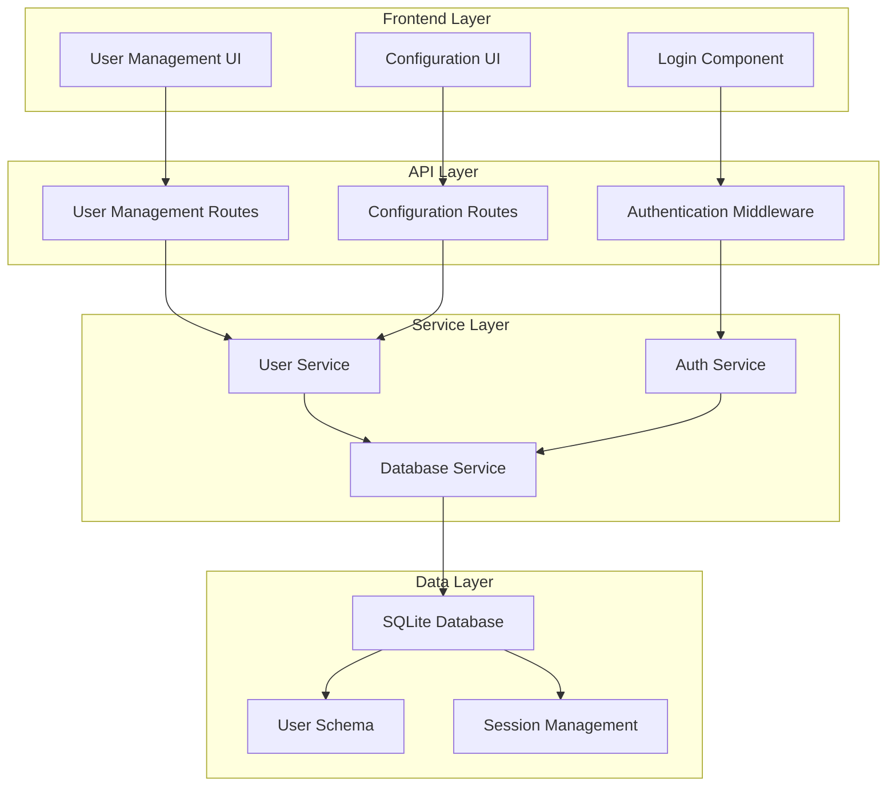

# Design Document

## Overview

The User Management System extends the existing B9 Website Manager with comprehensive user authentication and administration capabilities. The system implements a secure, JWT-based authentication mechanism with SQLite database storage, providing both API endpoints and frontend interfaces for user management operations.

## Architecture

The system follows a layered architecture pattern:



## Components and Interfaces

### Authentication Service
- **Purpose**: Handles user authentication, JWT token generation and validation
- **Key Methods**:
  - `authenticate(username, password)`: Validates credentials and returns JWT token
  - `validateToken(token)`: Verifies JWT token validity and extracts user claims
  - `refreshToken(token)`: Generates new token for session extension
  - `hashPassword(password)`: Securely hashes passwords using bcrypt

### User Service
- **Purpose**: Manages user CRUD operations and business logic
- **Key Methods**:
  - `createUser(userData)`: Creates new user with validation
  - `updateUser(id, userData)`: Updates existing user information
  - `deleteUser(id)`: Removes user and invalidates sessions
  - `listUsers()`: Returns user list without sensitive data
  - `getUserById(id)`: Retrieves specific user information

### Database Service
- **Purpose**: Handles SQLite database operations and schema management
- **Key Methods**:
  - `initializeDatabase()`: Creates database schema if not exists
  - `createDefaultUser()`: Sets up initial admin user
  - `migrateSchema()`: Updates database schema for new versions
  - `validateIntegrity()`: Checks database consistency

### Authentication Middleware
- **Purpose**: Protects API endpoints and validates user sessions
- **Key Functions**:
  - Token extraction from request headers
  - JWT signature and expiration validation
  - User permission verification
  - Rate limiting for authentication attempts

## Data Models

### User Schema
```sql
CREATE TABLE users (
    id INTEGER PRIMARY KEY AUTOINCREMENT,
    username VARCHAR(50) UNIQUE NOT NULL,
    email VARCHAR(100) UNIQUE NOT NULL,
    password_hash VARCHAR(255) NOT NULL,
    role VARCHAR(20) DEFAULT 'user',
    is_active BOOLEAN DEFAULT 1,
    must_change_password BOOLEAN DEFAULT 0,
    created_at DATETIME DEFAULT CURRENT_TIMESTAMP,
    updated_at DATETIME DEFAULT CURRENT_TIMESTAMP,
    last_login DATETIME
);
```

### JWT Token Structure
```json
{
  "header": {
    "alg": "HS256",
    "typ": "JWT"
  },
  "payload": {
    "sub": "user_id",
    "username": "user_name",
    "role": "admin|user",
    "iat": 1234567890,
    "exp": 1234567890
  }
}
```

### API Request/Response Models

#### Login Request
```typescript
interface LoginRequest {
  username: string;
  password: string;
}
```

#### Login Response
```typescript
interface LoginResponse {
  success: boolean;
  token?: string;
  user?: {
    id: number;
    username: string;
    email: string;
    role: string;
    mustChangePassword: boolean;
  };
  error?: string;
}
```

#### User Model
```typescript
interface User {
  id: number;
  username: string;
  email: string;
  role: 'admin' | 'user';
  isActive: boolean;
  mustChangePassword: boolean;
  createdAt: string;
  updatedAt: string;
  lastLogin?: string;
}
```

## Correctness Properties

*A property is a characteristic or behavior that should hold true across all valid executions of a system-essentially, a formal statement about what the system should do. Properties serve as the bridge between human-readable specifications and machine-verifiable correctness guarantees.*

### Property Reflection

After reviewing all testable properties from the prework analysis, I identified several areas where properties can be consolidated:

- Authentication properties (1.1, 1.2, 1.3, 1.4) can be combined into comprehensive authentication behavior
- Database validation properties (2.3, 2.5, 3.1, 3.2) share common validation logic
- Security properties (5.1, 5.2, 5.3) all relate to API security validation
- Token management properties (7.1, 7.2, 7.3) can be unified under JWT token handling

### Property 1: Authentication Round Trip
*For any* valid user credentials, authenticating should generate a valid JWT token that can be used to access protected resources, and logging out should invalidate that token
**Validates: Requirements 1.1, 1.4, 7.1**

### Property 2: Invalid Credentials Rejection
*For any* invalid credential combination (wrong username, wrong password, non-existent user), authentication should fail and return appropriate error messages
**Validates: Requirements 1.2, 5.2**

### Property 3: Session Expiration Enforcement
*For any* expired JWT token, accessing protected endpoints should return 401 Unauthorized and require re-authentication
**Validates: Requirements 1.3, 5.2, 7.2**

### Property 4: Password Security
*For any* password stored in the database, it should be hashed using bcrypt and the original password should never be retrievable
**Validates: Requirements 2.3, 3.4**

### Property 5: User CRUD Validation
*For any* user management operation (create, update, delete), the system should validate input data and maintain database consistency
**Validates: Requirements 3.1, 3.2, 3.3, 2.5**

### Property 6: Admin Protection
*For any* system state with only one admin user, attempting to delete that admin should be rejected to prevent system lockout
**Validates: Requirements 3.5**

### Property 7: API Security Enforcement
*For any* protected API endpoint, requests without valid JWT tokens should be rejected with 401 Unauthorized
**Validates: Requirements 5.1, 8.2, 8.3**

### Property 8: Input Sanitization
*For any* user input to the system, malicious content should be sanitized and invalid data should be rejected with appropriate error messages
**Validates: Requirements 5.3**

### Property 9: Rate Limiting Protection
*For any* series of authentication attempts from the same source, excessive attempts should be blocked to prevent brute force attacks
**Validates: Requirements 5.4**

### Property 10: Audit Logging Completeness
*For any* user management operation (login, create, update, delete), the action should be logged with timestamp, user, and operation details
**Validates: Requirements 5.5**

### Property 11: Database Initialization Idempotence
*For any* system startup, running database initialization multiple times should result in the same final state without errors
**Validates: Requirements 6.4, 6.5**

### Property 12: Token Refresh Continuity
*For any* valid JWT token near expiration, the refresh mechanism should generate a new valid token while maintaining user session continuity
**Validates: Requirements 7.3, 7.5**

### Property 13: Backward Compatibility Preservation
*For any* existing configuration API endpoint, adding user management should not break existing functionality or change API contracts
**Validates: Requirements 8.1, 8.4**

## Error Handling

### Authentication Errors
- **Invalid Credentials**: Return 401 with descriptive error message
- **Account Locked**: Return 423 with lockout duration information
- **Token Expired**: Return 401 with token refresh instructions
- **Rate Limited**: Return 429 with retry-after header

### Validation Errors
- **Missing Required Fields**: Return 400 with field-specific error messages
- **Invalid Data Format**: Return 400 with format requirements
- **Duplicate Username/Email**: Return 409 with conflict details
- **Permission Denied**: Return 403 with required permission information

### Database Errors
- **Connection Failed**: Return 503 with retry instructions
- **Schema Migration Failed**: Log error and prevent startup
- **Data Integrity Violation**: Return 422 with constraint details
- **Transaction Rollback**: Log error and return 500 with safe error message

## Testing Strategy

### Dual Testing Approach
The system will use both unit tests and property-based tests for comprehensive coverage:

**Unit Tests** will focus on:
- Specific authentication scenarios (valid login, invalid password, etc.)
- Database initialization and migration edge cases
- JWT token generation and validation examples
- API endpoint integration with known test data
- Error handling for specific failure conditions

**Property-Based Tests** will focus on:
- Universal authentication behavior across all credential combinations
- Database validation across all possible input variations
- JWT token security properties across all token states
- API security enforcement across all endpoint combinations
- Input sanitization across all possible malicious inputs

### Property-Based Testing Configuration
- **Testing Framework**: fast-check for JavaScript/TypeScript property testing
- **Minimum Iterations**: 100 iterations per property test
- **Test Tagging**: Each property test tagged with format: **Feature: user-management, Property {number}: {property_text}**
- **Generator Strategy**: Smart generators that create realistic user data, valid/invalid credentials, and edge cases

### Testing Data Generators
- **User Generator**: Creates valid user objects with realistic usernames, emails, and roles
- **Credential Generator**: Generates both valid and invalid login combinations
- **Token Generator**: Creates valid, expired, and malformed JWT tokens
- **Malicious Input Generator**: Creates SQL injection, XSS, and other attack vectors
- **Database State Generator**: Creates various database states for migration testing