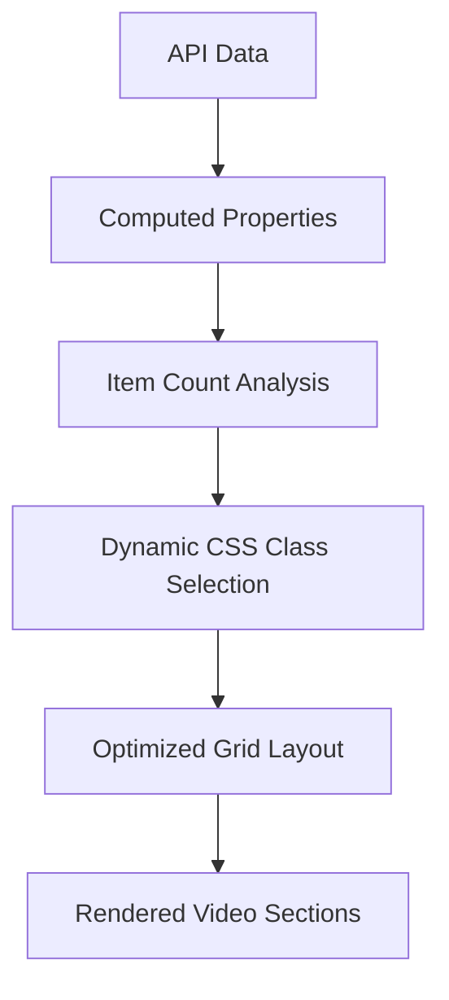

# Design Document

## Overview

This design addresses the optimization of video section layouts in the demo frontend by replacing the current `auto-fit` CSS grid approach with a dynamic layout system that adapts to the actual number of items. The solution involves modifying the computed properties and CSS to eliminate empty grid spaces when fewer items are available.

## Architecture

The current architecture uses:
- Vue.js computed properties (`effectiveVideoThumbnails`, `effectiveProgramThumbnails`) that return raw API data
- CSS Grid with `auto-fit` that creates fixed column layouts regardless of content count
- Static grid templates that leave empty spaces for missing items

The optimized architecture will use:
- Enhanced computed properties that determine optimal column count based on item count
- Dynamic CSS classes that apply appropriate grid templates
- Responsive logic that maintains visual consistency across screen sizes

## Components and Interfaces

### Frontend Components

**HomePage.vue**
- **Current**: Uses `effectiveVideoThumbnails` and `effectiveProgramThumbnails` computed properties
- **Enhanced**: Add new computed properties for dynamic column calculation
- **Template**: Apply dynamic CSS classes based on item count

**CSS Grid System**
- **Current**: Fixed `auto-fit` grid with `minmax(150px, 1fr)`
- **Enhanced**: Multiple grid template classes for different item counts
- **Responsive**: Maintain existing breakpoints while optimizing column count

### Data Flow



## Data Models

### Grid Configuration

```typescript
interface GridConfig {
  itemCount: number
  maxColumns: number
  optimalColumns: number
  cssClass: string
}

interface VideoDisplayConfig {
  videos: GridConfig
  programs: GridConfig
}
```

### Responsive Breakpoints

```typescript
interface ResponsiveConfig {
  desktop: {
    maxColumns: number
    minItemWidth: number
  }
  tablet: {
    maxColumns: number
    minItemWidth: number
  }
  mobile: {
    maxColumns: number
    minItemWidth: number
  }
}
```

## Implementation Strategy

### Phase 1: Computed Property Enhancement

1. **Create Dynamic Column Calculators**
   - Add `videoGridConfig` computed property
   - Add `programGridConfig` computed property
   - Calculate optimal columns based on item count and screen size

2. **Grid Class Generation**
   - Generate CSS class names based on item count
   - Handle edge cases (0 items, 1 item, etc.)
   - Maintain responsive behavior

### Phase 2: CSS Grid Optimization

1. **Replace Auto-Fit Grid**
   - Create specific grid templates for 1-8 items
   - Remove `auto-fit` to eliminate empty spaces
   - Maintain existing gap and sizing

2. **Responsive Grid Classes**
   - `.grid-1-item`, `.grid-2-items`, `.grid-3-items`, etc.
   - Media query variants for each breakpoint
   - Fallback to existing behavior for edge cases

### Phase 3: Template Integration

1. **Dynamic Class Binding**
   - Apply computed CSS classes to `.list` elements
   - Maintain existing item structure and styling
   - Preserve hover effects and functionality

## Error Handling

### Empty State Handling
- When `itemCount === 0`: Show existing empty placeholder
- When `itemCount > maxColumns`: Use maximum column layout
- When API fails: Fallback to existing behavior

### Responsive Edge Cases
- Very narrow screens: Force minimum viable layout
- Very wide screens: Cap maximum columns for readability
- Orientation changes: Recalculate grid on resize

## Correctness Properties

*A property is a characteristic or behavior that should hold true across all valid executions of a system-essentially, a formal statement about what the system should do. Properties serve as the bridge between human-readable specifications and machine-verifiable correctness guarantees.*

### Property 1: Dynamic grid eliminates empty spaces
*For any* video section (精選視頻 or 火熱影片) with 1-8 items, the rendered grid should display exactly that number of items with no empty placeholder elements
**Validates: Requirements 1.1, 1.2, 1.3**

### Property 2: Responsive layout optimization
*For any* viewport width and item count combination, the dynamic layout should maintain optimal spacing without empty placeholders while preserving existing breakpoint behavior
**Validates: Requirements 1.4, 2.4, 3.1, 3.2, 3.3, 3.4**

### Property 3: Visual consistency preservation
*For any* video section item, the thumbnail dimensions, aspect ratios, border styling, and spacing should remain identical to the original implementation
**Validates: Requirements 2.1, 2.3, 2.5**

### Property 4: Interactive functionality preservation
*For any* video section item, hover effects and click functionality should work identically to the original implementation
**Validates: Requirements 2.2**

### Property 5: CSS breakpoint preservation
*For any* existing media query breakpoint, the same breakpoint values and responsive behavior should be maintained in the optimized implementation
**Validates: Requirements 1.5**

## Testing Strategy

### Unit Tests
- Test computed property calculations for various item counts
- Test CSS class generation logic
- Test responsive breakpoint behavior
- Test edge cases (0 items, 1 item, maximum items)

### Property-Based Tests
- **Property 1**: Generate random item counts (1-8) and verify no empty spaces in rendered output
- **Property 2**: Generate random viewport widths and item counts, verify optimal layout without empty spaces
- **Property 3**: Generate random video items and verify visual properties match expected values
- **Property 4**: Generate random video items and verify interactive events work correctly
- **Property 5**: Verify all existing CSS breakpoints are preserved in new implementation

### Visual Regression Tests
- Compare layouts before and after optimization
- Test across different screen sizes
- Verify hover states and interactions remain intact
- Test with various item counts (1-8 items)

### Integration Tests
- Test with real API data
- Test responsive behavior during window resize
- Test performance impact of dynamic calculations
- Test fallback behavior when API fails