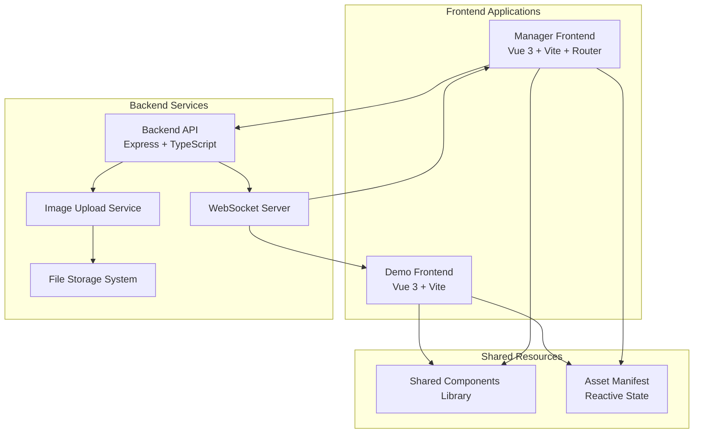
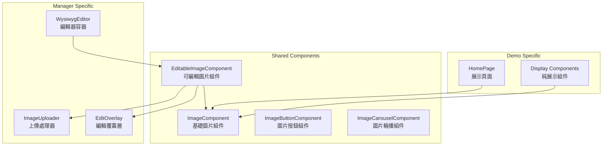

# 所見即所得圖片編輯系統設計文件

## 概述

本設計文件詳細說明了一個基於 Vue 3 Monorepo 架構的所見即所得圖片編輯系統。系統採用共享組件庫策略確保視覺一致性，使用 WebSocket 實現即時同步，並通過統一的 Asset Manifest 管理所有圖片資源。

## 架構設計

### 整體架構



### 技術棧選擇

**前端技術：**
- Vue 3 Composition API - 提供響應式狀態管理
- Vite - 快速開發和熱更新支援
- TypeScript - 型別安全和更好的開發體驗
- Pinia - 狀態管理（Manager Frontend）

**後端技術：**
- Express.js - RESTful API 服務
- Multer - 檔案上傳處理
- Socket.io - WebSocket 即時通訊
- TypeScript - 統一的開發語言

**共享資源：**
- 共享 Vue 組件庫 - 確保視覺一致性
- 統一的 Asset Manifest - 單一資料來源

## 組件和介面設計

### 核心組件架構



### 組件介面定義

**ImageComponent (基礎圖片組件)**
```typescript
interface ImageComponentProps {
  src: string
  alt?: string
  loading?: 'lazy' | 'eager'
  fallback?: string
  className?: string
  style?: CSSProperties
}

interface ImageComponentEmits {
  load: (event: Event) => void
  error: (error: Error) => void
  click: (event: MouseEvent) => void
}
```

**EditableImageComponent (可編輯圖片組件)**
```typescript
interface EditableImageProps extends ImageComponentProps {
  editable: boolean
  assetPath: string
  assetType: 'single' | 'button' | 'carousel' | 'array'
  uploadEndpoint: string
}

interface EditableImageEmits {
  uploadStart: (assetPath: string) => void
  uploadProgress: (progress: number) => void
  uploadComplete: (newSrc: string) => void
  uploadError: (error: Error) => void
}
```

**WysiwygEditor (編輯器容器)**
```typescript
interface WysiwygEditorProps {
  mode: 'edit' | 'preview'
  assetManifest: AssetManifest
  apiBaseUrl: string
}

interface WysiwygEditorEmits {
  assetUpdate: (path: string, newValue: any) => void
  modeChange: (mode: 'edit' | 'preview') => void
}
```

## 資料模型

### Asset Manifest 結構

```typescript
interface AssetManifest {
  logo: string
  banner: string
  buttonLinks: ButtonLink[]
  carouselSlides: string[]
  titles: TitleImages
  routeLinks: RouteLinks
  toolIcons: ToolIcon[]
  videoThumbnails: string[]
  programThumbnails: string[]
  floatAdButtons: FloatAdButton[]
}

interface ButtonLink {
  id: string
  default: string
  hover: string
  alt: string
}

interface TitleImages {
  recommendedRoutes: string
  recommendedBrowsers: string
  selectedVideos: string
  hotPrograms: string
}

interface RouteLinks {
  default: string
  hover: string
}

interface ToolIcon {
  id: string
  default: string
  hover: string
  alt: string
}

interface FloatAdButton {
  id: string
  default: string
  hover: string
  alt: string
}
```

### API 資料模型

**圖片上傳請求**
```typescript
interface ImageUploadRequest {
  file: File
  assetPath: string
  assetType: 'single' | 'button' | 'carousel' | 'array'
  position?: number // 用於陣列類型
}

interface ImageUploadResponse {
  success: boolean
  data?: {
    filename: string
    path: string
    size: number
    mimetype: string
  }
  error?: string
}
```

**配置更新事件**
```typescript
interface ConfigUpdateEvent {
  type: 'asset_update'
  timestamp: number
  changes: {
    path: string
    oldValue: any
    newValue: any
  }[]
  manifest: AssetManifest
}
```

### WebSocket 事件模型

```typescript
interface WebSocketEvents {
  // 客戶端到服務端
  'join_room': (room: string) => void
  'leave_room': (room: string) => void
  
  // 服務端到客戶端
  'config_updated': (event: ConfigUpdateEvent) => void
  'upload_progress': (data: { assetPath: string, progress: number }) => void
  'connection_status': (status: 'connected' | 'disconnected') => void
}
```

## 錯誤處理策略

### 錯誤分類和處理

**檔案上傳錯誤**
```typescript
enum UploadErrorType {
  FILE_TOO_LARGE = 'FILE_TOO_LARGE',
  INVALID_FORMAT = 'INVALID_FORMAT',
  NETWORK_ERROR = 'NETWORK_ERROR',
  SERVER_ERROR = 'SERVER_ERROR',
  PERMISSION_DENIED = 'PERMISSION_DENIED'
}

interface UploadError extends Error {
  type: UploadErrorType
  details?: any
}
```

**配置同步錯誤**
```typescript
enum SyncErrorType {
  CONNECTION_LOST = 'CONNECTION_LOST',
  CONFIG_CONFLICT = 'CONFIG_CONFLICT',
  INVALID_CONFIG = 'INVALID_CONFIG',
  PERMISSION_ERROR = 'PERMISSION_ERROR'
}

interface SyncError extends Error {
  type: SyncErrorType
  retryable: boolean
  retryAfter?: number
}
```

### 錯誤恢復機制

1. **自動重試策略** - 網路錯誤採用指數退避重試
2. **配置備份** - 每次更新前自動備份當前配置
3. **衝突解決** - 採用最後寫入優先 (Last Write Wins) 策略
4. **離線支援** - 快取最後已知的良好配置

## 測試策略

### 單元測試

**組件測試重點：**
- ImageComponent 的載入狀態和錯誤處理
- EditableImageComponent 的上傳流程
- WysiwygEditor 的模式切換和事件處理

**服務測試重點：**
- 圖片上傳服務的檔案驗證
- Asset Manifest 的更新邏輯
- WebSocket 連線和事件處理

### 整合測試

**前後端整合：**
- 完整的圖片上傳和配置更新流程
- WebSocket 即時同步功能
- 錯誤情況下的系統行為

**跨瀏覽器測試：**
- 不同瀏覽器的檔案上傳相容性
- WebSocket 連線穩定性
- 響應式設計在不同裝置上的表現

## 正確性屬性

*A property is a characteristic or behavior that should hold true across all valid executions of a system-essentially, a formal statement about what the system should do. Properties serve as the bridge between human-readable specifications and machine-verifiable correctness guarantees.*

### 視覺一致性屬性

**屬性 1: 視覺佈局一致性**
*對於任何* 給定的 Asset Manifest 配置，WYSIWYG_Editor 和 Demo_Frontend 應該渲染出相同的視覺佈局和樣式
**驗證需求: Requirements 1.1**

**屬性 2: 自動同步一致性**
*對於任何* Demo_Frontend 的樣式或佈局變更，WYSIWYG_Editor 應該自動同步相同的視覺變更
**驗證需求: Requirements 1.2**

**屬性 3: 響應式行為一致性**
*對於任何* 視窗大小或互動操作，WYSIWYG_Editor 和 Demo_Frontend 應該展現相同的響應式行為
**驗證需求: Requirements 1.3, 1.5**

### 圖片上傳屬性

**屬性 4: 點擊觸發一致性**
*對於任何* 可編輯的圖片區域，點擊操作應該觸發檔案選擇對話框
**驗證需求: Requirements 2.1**

**屬性 5: 檔案格式驗證**
*對於任何* 上傳的檔案，系統應該只接受 PNG、JPG 或 JPEG 格式的圖片檔案
**驗證需求: Requirements 2.2**

**屬性 6: 上傳成功處理**
*對於任何* 成功上傳的圖片，Backend_API 應該正確儲存檔案並更新對應的 Asset_Manifest 路徑
**驗證需求: Requirements 2.4**

**屬性 7: 錯誤狀態保持**
*對於任何* 上傳失敗的情況，系統應該保持原有圖片不變並顯示適當的錯誤訊息
**驗證需求: Requirements 2.5, 5.1**

### 即時同步屬性

**屬性 8: 配置廣播完整性**
*對於任何* Asset_Manifest 的更新，Config_Broadcasting 應該通知所有連接的客戶端
**驗證需求: Requirements 3.1**

**屬性 9: 前台同步更新**
*對於任何* 接收到的配置更新通知，Demo_Frontend 應該重新載入對應的圖片資源
**驗證需求: Requirements 3.2**

**屬性 10: 後台同步更新**
*對於任何* 接收到的配置更新通知，WYSIWYG_Editor 應該即時更新預覽畫面
**驗證需求: Requirements 3.3**

**屬性 11: 網路恢復同步**
*對於任何* 網路中斷後的連線恢復，系統應該自動同步最新的配置狀態
**驗證需求: Requirements 3.4**

**屬性 12: 並發編輯同步**
*對於任何* 多個管理者的同時編輯操作，所有使用者應該看到最新的變更結果
**驗證需求: Requirements 3.5**

### 資源管理屬性

**屬性 13: 單一圖片替換**
*對於任何* 單一圖片資源的上傳，系統應該直接替換 Asset_Manifest 中對應的圖片路徑
**驗證需求: Requirements 4.1**

**屬性 14: 按鈕圖片處理**
*對於任何* 按鈕圖片的上傳，系統應該同時處理 default 和 hover 狀態的圖片配置
**驗證需求: Requirements 4.2**

**屬性 15: 陣列操作完整性**
*對於任何* 圖片陣列的新增或刪除操作，Asset_Manifest 應該維持資料結構的完整性
**驗證需求: Requirements 4.3, 4.4, 4.5**

### 錯誤處理屬性

**屬性 16: 備份恢復機制**
*對於任何* Asset_Manifest 檔案損壞的情況，系統應該從備份檔案正確恢復配置
**驗證需求: Requirements 5.2**

**屬性 17: 離線狀態處理**
*對於任何* Backend_API 服務中斷的情況，Manager_Frontend 應該顯示離線狀態並禁用編輯功能
**驗證需求: Requirements 5.3**

**屬性 18: 圖片載入失敗處理**
*對於任何* 圖片檔案載入失敗的情況，系統應該顯示預設的佔位圖片
**驗證需求: Requirements 5.4**

**屬性 19: 配置衝突解決**
*對於任何* 偵測到的配置衝突，Real_Time_Sync 應該以最後更新的版本為準並通知所有客戶端
**驗證需求: Requirements 5.5**

### 使用者介面屬性

**屬性 20: 編輯提示顯示**
*對於任何* 可編輯圖片的滑鼠懸停操作，系統應該顯示編輯提示覆蓋層
**驗證需求: Requirements 6.1**

**屬性 21: 上傳進度顯示**
*對於任何* 正在進行的圖片上傳，系統應該顯示上傳進度指示器
**驗證需求: Requirements 6.2**

**屬性 22: 成功提示自動隱藏**
*對於任何* 完成的圖片上傳，系統應該顯示成功提示並在適當時間後自動隱藏
**驗證需求: Requirements 6.3**

**屬性 23: 長時間操作響應性**
*對於任何* 長時間執行的操作，使用者介面應該保持響應並顯示適當的載入狀態
**驗證需求: Requirements 6.5**

### 屬性反思

經過分析，以下屬性可以合併以減少冗餘：

1. **屬性 1 和屬性 3** 可以合併為一個綜合的視覺一致性屬性，涵蓋佈局、樣式和響應式行為
2. **屬性 9 和屬性 10** 可以合併為一個統一的同步更新屬性，適用於所有前端應用
3. **屬性 13、14、15** 可以合併為一個綜合的資源管理屬性，涵蓋所有類型的圖片操作

合併後的核心屬性：

**核心屬性 1: 完整視覺一致性**
*對於任何* Asset Manifest 配置和使用者互動，WYSIWYG_Editor 和 Demo_Frontend 應該在佈局、樣式和響應式行為上保持完全一致
**驗證需求: Requirements 1.1, 1.2, 1.3, 1.5**

**核心屬性 2: 統一同步更新**
*對於任何* 配置更新通知，所有前端應用應該即時同步更新對應的圖片資源和預覽畫面
**驗證需求: Requirements 3.2, 3.3**

**核心屬性 3: 綜合資源管理**
*對於任何* 類型的圖片資源操作（單一、按鈕、陣列），系統應該正確處理並維持 Asset_Manifest 的資料結構完整性
**驗證需求: Requirements 4.1, 4.2, 4.3, 4.4, 4.5**